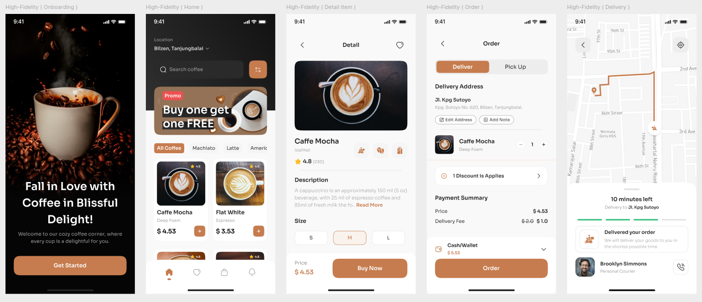
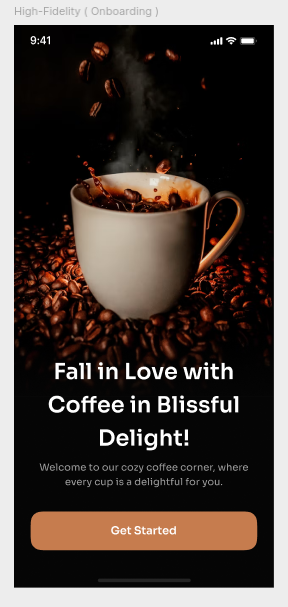
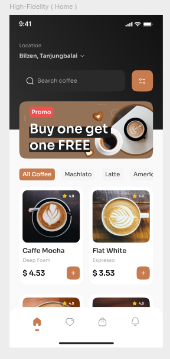
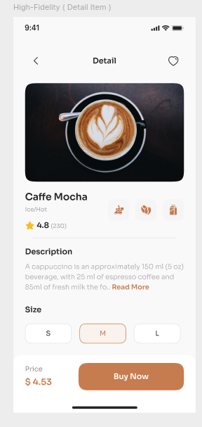
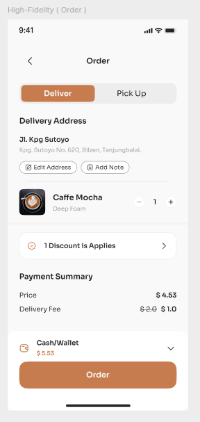
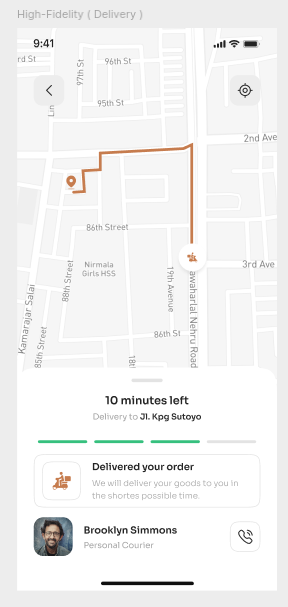
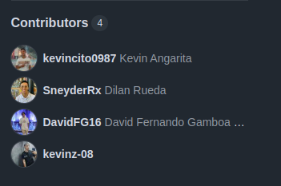

# ☕ Coffee App - Tienda de Café Online

Bienvenido a **Coffee App**, una aplicación web diseñada para los amantes del café. ☕✨ Con esta interfaz moderna y atractiva, puedes explorar diferentes tipos de café, hacer pedidos y recibir entregas rápidas.

🚀 **Tecnologías utilizadas:**

✅ **HTML**

✅ **CSS**

------

## 📸 **Vista previa del diseño**

Aquí tienes una captura de pantalla de la aplicación en alta concentración:

------

## 📌 Índice

1️⃣ **Onboarding Page - Pantalla de Bienvenida**

2️⃣ **Home Page - Catálogo de Cafés**

3️⃣ **Product Detail Page - Detalle del Producto**

4️⃣ **Order Page - Confirmación de Pedido**

5️⃣ **Delivery Page - Seguimiento de Entrega**

6️⃣ **Contribuyentes** 

7️⃣ **Advertencia Importante**

------

## **1️⃣ Onboarding Page - Pantalla de Bienvenida 🚀**

📍 **Descripción:**
La primera pantalla que el usuario ve. Presenta un **mensaje inspirador** sobre el café y un botón para empezar a explorar la tienda.

🖼 **Ejemplo:**

🔹 **Elementos clave:**

✅ Fondo oscuro con una imagen atractiva de café y granos.

✅ Texto llamativo: *"Fall in Love with Coffee in Blissful Delight!"*

✅ Botón **"Get Started"** en color marrón para iniciar la app.

------

## **2️⃣ Home Page - Catálogo de Cafés 🏠**

📍 **Descripción:**
Pantalla principal donde el usuario **explora y selecciona** diferentes tipos de café.

🖼 **Ejemplo:**

🔹 **Elementos clave:**

✅ **Barra de búsqueda** para encontrar cafés rápidamente.

✅ **Sección de promociones** con la oferta *"Buy one get one FREE"*.

✅ Lista de cafés con imagen, nombre, precio y calificación ⭐.

✅ Botón para **agregar productos al carrito** fácilmente.

------

## **3️⃣ Product Detail Page - Detalle del Producto 🛍️**

📍 **Descripción:**
Muestra detalles de un café seleccionado, permitiendo al usuario elegir el tamaño y comprarlo.

🖼 **Ejemplo:**

🔹 **Elementos clave:**

✅ Imagen grande del café seleccionado.

✅ **Descripción completa** con ingredientes y preparación.

✅ **Calificación promedio** con estrellas ⭐.

✅ Opciones de tamaño (S, M, L).

✅ Botón **"Buy Now"** para comprar el producto.

------

## **4️⃣ Order Page - Confirmación de Pedido 📦**

📍 **Descripción:**
Pantalla donde el usuario confirma su dirección de entrega y revisa el resumen de pago.

🖼 **Ejemplo:**

🔹 **Elementos clave:**

✅ **Opciones de entrega o recogida**.

✅ **Dirección de envío editable**.

✅ Lista con el café seleccionado y su precio.

✅ **Descuento aplicado** y total a pagar.

✅ Botón **"Order"** para confirmar la compra.

------

## **5️⃣ Delivery Page - Seguimiento de Entrega 🏍️**

📍 **Descripción:**
Permite al usuario rastrear el estado de su pedido en tiempo real.

🖼 **Ejemplo:**

🔹 **Elementos clave:**

✅ **Mapa interactivo** con la ruta de entrega.

✅ **Tiempo estimado de llegada** ("10 minutes left").

✅ Estado del pedido: *"Delivered your order"* con mensaje de confirmación.

✅ Información del **repartidor** con foto y nombre.

------

## **6️⃣ Contribuyentes 👨‍💻👩‍💻**

💡 **Este proyecto fue desarrollado por:**

- **kevcincito0987** - Kevin Angarita
- **SneyderRx** - Dilan Rueda
- **DavidFG16** - David Fernando Gamboa
- **kevinz-08**

📸 **Captura de los contribuyentes y tecnologías usadas:**

✅ **Lenguajes utilizados en el proyecto:**

- **CSS:** 63.9%
- **HTML:** 36.1%

------

## ⚠️ **Advertencia Importante**

🚨 **PROFESOR, IMPORTANTE: NO SE PUDO DESPLEGAR EN GITHUB PAGES** 🚨

🔴 **Motivo:** GitHub Pages **no permite publicar repositorios privados de forma gratuita**. Para desplegarlo, es necesario **pagar por GitHub Pro** o hacer el repositorio **público**.

💡 **Alternativa:** Puede descargar el código y abrir `index.html` en su navegador para ver la aplicación funcionando.

✅ **Navegacion entre el maps del delivery** en cada icono de flecha redirige a ordenes diferentes.
------

📌 *Hecho con ❤️ y mucho café.* ☕
